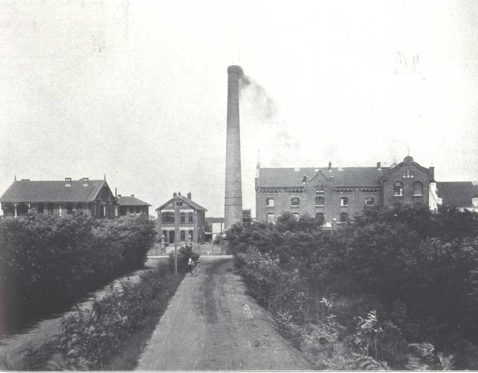

--- 

# Deutsche Kolonialzeit in China

  
*Postkarte aus der chinesischen Provinz Kiao-Tschau, Deutsches Reich, 1900* [Quelle: Lemo](https://www.dhm.de/lemo/bestand/objekt/gruss-aus-kiao-tschau-postkarte-zum-deutsch-chinesischen-konflikt-1900.html)

*Zwischen 1898 und 1919 hatte das Deutsche Reich die chinesische Provinz Kiao-Tschau &bdquo;gemietet&ldquo;. Sehen Sie sich die deutsche Postkarte aus dem Jahr 1900 an. Wie ist das Verhältnis zwischen Chinesen und Deutschen hier abgebildet? Notieren Sie.*

<textarea rows="8" cols="50"></textarea>

*Was wissen Sie schon über die deutsche Kolonialherrschaft in China? Notieren Sie.*

<textarea rows="8" cols="50"></textarea>

---

*Im Folgenden hören und lesen Sie einen Podcast. Vorher sehen Sie sich die Wortwolke mit häufigen Wörtern aus dem Podcast an. Welche Wörter sind Ihnen unbekannt? Schauen Sie ihre Bedeutung im <a href="https://www.dwds.de/" target="_blank">Wörterbuch</a> nach und notieren Sie.*

<textarea rows="8" cols="50"></textarea>

 

---

### Es blieben Architektur und Bier

[Quelle: Deutschlandfunk](https://www.deutschlandfunk.de/deutsche-kolonialzeit-in-china-es-blieben-architektur-und.769.de.html?dram:article_id=480264), 20.07.2020

<audio controls id="meinAudio" src="Audio-Deutsche-Kolonialzeit-China.mp3"></audio>

*Hören und lesen Sie den Podcast. Hören Sie den Podcast erst einmal von Anfang bis Ende. Hören Sie dann jeden Abschnitt noch einmal einzeln an. Wählen Sie hierzu eine passende Zeit und drücken Sie auf Abspielen/Pause. Formulieren Sie für jeden Abschnitt eine geeignete Zwischenüberschrift.*

<button onclick="setCurTime0()" type="button">Anfang</button><button onclick="togglePlayPause()" type="button">Abspielen/Pause</button>

 

 
<input type="text" style="width:75%; font-weight:bold;">

Die Deutschlandfunk Denkfabrik

An fünf Tagen in der vergangenen Woche wurden an dieser Stelle wirtschaftliche Folgen der Kolonialzeit beleuchtet. Heute im letzten Teil geht es um ein ehemaliges deutsches Kolonialgebiet an der Ostküste Chinas. Zwischen 1898 und 1919 war es gepachtet worden. In der Hauptstadt Qingdao gründeten Anfang des 20. Jahrhunderts Siedler aus Deutschland eine Brauerei, die bis heute die zweitgrößte in China ist. Tsingtao heißt sie, so wie die Stadt damals. Das moderne Qingdao ist zur Millionenstadt angewachsen, hat aber seinen Altstadtkern mit deutscher Kaiserreich-Architektur behalten. Axel Dorloff mit einem Besuch dort. 

<button onclick="setCurTime1()" type="button">00:46</button><button onclick="togglePlayPause()" type="button">Abspielen/Pause</button>

 

  <input type="text" style="width:75%; font-weight:bold;">

Deutsche Matrosen, die Anfang des 20. Jahrhunderts an Chinas Ostküste Karten spielen und Flaschenbier trinken. Bier aus der Germania Brauerei. Die wurde 1903 von deutschen und britischen Kaufleuten in Qingdao gegründet. Die alten Schwarz-Weiß-Fotos hängen im Biermuseum in der Tsingtao-Brauerei in Qingdao. 

<button onclick="setCurTime2()" type="button">01:07</button><button onclick="togglePlayPause()" type="button">Abspielen/Pause</button>

 

  <input type="text" style="width:75%; font-weight:bold;">

Die chinesische Stadt Qingdao am Gelben Meer war damals eine deutsche Kolonie. Und wo ein Stützpunkt war, sollte auch eine Brauerei sein, erzählt Li Jingyuan vom Biermuseum der Tsingtao-Brauerei: &bdquo;1897 haben deutsche Truppen Qingdao besetzt. Und dann haben sie schon bald die Brauerei gegründet, vor allem für die deutschen Matrosen und Truppen. Die wollten nicht ohne Bier sein, deshalb wurde diese Brauerei 1903 eröffnet. 2000 Tonnen konnten sie damals im Jahr produzieren, das produzieren wir heute am Tag.&ldquo;

<button onclick="setCurTime3()" type="button">01:44</button><button onclick="togglePlayPause()" type="button">Abspielen/Pause</button>

  <input type="text" style="width:75%; font-weight:bold;">

Das Deutsche Kaiserreich hat das Gebiet um die Bucht von Kiaotschou im Jahr 1898 für 99 Jahre gepachtet. Man wollte einen Stützpunkt an der chinesischen Ostküste, sowohl für die eigene Flotte als auch für den Chinahandel. Es entstand eine ethnisch und ständisch gegliederte Siedlung. Im Süden die Europäer-Stadt, im Norden chinesische Geschäftsleute, noch weiter draußen die Arbeitersiedlungen. Das frische Quellwasser für die Brauerei kam damals aus dem benachbarten Berg Lao Shan, die anderen Rohstoffe mit dem Schiff aus Deutschland.

<button onclick="setCurTime4()" type="button">02:18</button><button onclick="togglePlayPause()" type="button">Abspielen/Pause</button>

  <input type="text" style="width:75%; font-weight:bold;">

Die Gebäude der Tsingtao-Brauerei erinnern an klassische deutsche Brauerei-Architektur: Rote Backsteinfassaden, eine Turmuhr, die für damals typische Unterteilung in Mälzerei, Sudhaus, Kühl- und Lagerhaus sowie Nebengebäude. Gebraut wurde 1903 zunächst ein helles Bier nach Pilsner Art und ein dunkles Bier nach Münchener Art - anfangs noch nach dem deutschen Reinheitsgebot. Davon hat man sich aber im Laufe der Zeit verabschiedet. Passt nicht zum Bier-Geschmack der Chinesen, sagt Tsingtao-Braumeisterin Zhang Pei:

<button onclick="setCurTime5()" type="button">02:49</button><button onclick="togglePlayPause()" type="button">Abspielen/Pause</button>

  <input type="text" style="width:75%; font-weight:bold;">

&bdquo;Wir haben das Bier dem Bedarf unserer Verbraucher angepasst. Der einzige Unterschied zum deutschen Bier liegt darin, dass wir Reis dazu genommen haben, damit der Geschmack leichter und süffiger wird. Ansonsten ist der traditionelle deutsche Geschmack zum großen Teil erhalten. Nur was die Bitterkeit angeht, schmeckt das Tsingtao-Bier leichter und süßer, nicht so stark wie früher.&ldquo;

<button onclick="setCurTime6()" type="button">03:14</button><button onclick="togglePlayPause()" type="button">Abspielen/Pause</button>

  <input type="text" style="width:75%; font-weight:bold;">

Das Tsingtao-Bier ist eine der bekanntesten und ältesten Biermarken in China. Und die Brauerei hat eine wechselvolle Geschichte. Nach dem Ausbruch des Ersten Weltkrieges haben die Japaner die Brauerei betrieben, fast 30 Jahre wurden neben dem Tsingtao-Bier auch die Marken Asai und Kirin produziert. 1945 haben die Chinesen die Brauerei wieder übernommen, sie wurde zum Staatsbetrieb. Li Jingyuan vom Tsingtao-Biermuseum zeigt auf die vielen Fotos an der Wand, alles Kader der Kommunistischen Partei. &bdquo;Das sind die Direktoren der Tsingtao-Brauerei von 1949 bis 1993. Nach 1993 wurde es dann eine Aktiengesellschaft. Heute haben wir einen Vorstandsvorsitzenden.&ldquo;

<button onclick="setCurTime7()" type="button">03:57</button><button onclick="togglePlayPause()" type="button">Abspielen/Pause</button>

  <input type="text" style="width:75%; font-weight:bold;">

Obwohl die Chinesen die deutsche Kolonialherren damals ablehnten, wurde das Bier schon relativ bald beliebt. Unter der Planwirtschaft von Staatsgründer Mao Zedong gab es Bier aber Jahrzehnte lang nur mit speziellen Lebensmittelmarken. Heute gibt es 70 Tsingtao-Brauereien in ganz China - und das Bier wird in über 100 Länder exportiert. 1993 war die Tsingtao-Brauerei das erste festlandchinesische Unternehmen an der Börse in Hongkong. Auf dem Börsenparkett gab es damals Freibier - wie heute in der Kneipe des Biermuseums. 

<button onclick="setCurTime8()" type="button">04:27</button><button onclick="togglePlayPause()" type="button">Abspielen/Pause</button>

  <input type="text" style="width:75%; font-weight:bold;">

Kang Lu aus der Provinz Shanxi ist mit seinen Freunden auf einem Kurztrip in Qingdao. Auf dem Tisch vor ihm stehen acht kleine Gläser mit verschiedenen Bieren. &bdquo;Natürlich gehört dieses Museum in der Tsingtao-Brauerei zum Pflichtprogramm. Die Brauerei gehört zu den bekanntesten Gebäuden in Qingdao. Und die Geschichte hier kennt jeder Chinese. Wir kommen aber nicht nur, um uns die Gebäude anzuschauen, sondern auch um die Biere zu probieren.&ldquo;

<button onclick="setCurTime9()" type="button">04:56</button><button onclick="togglePlayPause()" type="button">Abspielen/Pause</button>

  <input type="text" style="width:75%; font-weight:bold;">

Qingdao ist heute eine der bekanntesten Küsten- und Hafenstädte in China, mit rund neun Millionen Einwohnern. Spuren der deutschen Kolonialgeschichte gibt es viele: das alte Gouverneurshaus, der Offiziersklub, die evangelische Christuskirche. Ganze Straßenzüge mit Architektur aus dem deutschen Kaiserreich. Dazu die alte Brauerei, die es zu Weltruhm gebracht hat. Deren Aktien steigen gerade wieder: Seit der Corona-Krise geht der Bierverkauf nach oben, auf dem heimischen Markt in China um 30 bis 40 Prozent.

Axel Dorloff über die Tsingtao-Brauerei. Letzter Teil unserer Serie über ökonomische Spuren der deutschen Kolonialzeit. Auch als Podcast nachzuhören. 

---

  
[Quelle: Bundesarchiv N224/90 (fol. 34)](https://www.bundesarchiv.de/DE/Content/Virtuelle-Ausstellungen/Deutschlands-Adler-Im-Reich-Des-Drachen-Deutschland-Und-China-Im-Zeitalter-Des-Kolonialismus-Teil-5-Gouvernement-Kiautschou/deutschlands-adler-im-reich-des-drachen-deutschland-und-china-im-zeitalter-des-kolonialismus-teil-5-gouvernement-kiautschou.html)

*Kreuzen Sie die richtigen Antworten an. Was ist vermutlich auf dem Bild zu sehen?*

<input type="checkbox"> Deutsches Gouverneurshaus  
<input type="checkbox"> Brauerei *Germania*  
<input type="checkbox"> Evangelische Christuskirche

*Von wann bis wann war Qingdao eine deutsche Kolonie?*

<input type="checkbox"> Von 1898 bis 1919  
<input type="checkbox"> Von 1918 bis 1945  
<input type="checkbox"> Von 1945 bis 1949

*Für wen wurde das Bier anfangs vor allem gebraut?*

<input type="checkbox"> Chinesische Einwohner von Qingdao  
<input type="checkbox"> Deutsche Adelige auf Reisen  
<input type="checkbox"> Deutsche Matrosen und Soldaten

*Von Anfang an lebten Chinesen und Deutsche friedlich und harmonisch zusammen.*

<input type="checkbox"> Richtig  
<input type="checkbox"> Falsch, richtig ist <input type="text" style="width:75%;">

*Nach dem Ausbruch des Ersten Weltkrieges wurde die Brauerei geschlossen.*

<input type="checkbox"> Richtig  
<input type="checkbox"> Falsch, richtig ist <input type="text" style="width:75%;">

*Welche &bdquo;Spuren der deutschen Kolonialgeschichte&ldquo; werden im Texte erwähnt? Notieren Sie.*  

<input type="text" style="width:75%;">

---

*Vergleichen Sie den Podcast mit der Postkarte vom Anfang. Die Beziehung zwischen Chinesen und Deutschen werden im Podcast und auf der Postkarte unterschiedlich dargestellt. Diskutieren Sie.* 

<textarea rows="12" cols="50"></textarea>

---

*Speichern Sie die Webseite mit Ihren Antworten, indem Sie einen Screenshot von der ganzen Webseite machen. In Firefox zum Beispiel: Machen Sie einen Rechtsklick. Wählen Sie &bdquo;Take a Screenshot&ldquo;. Wählen Sie &bdquo;Save full page&ldquo; aus.*