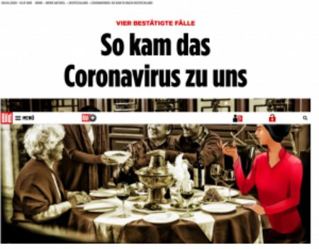
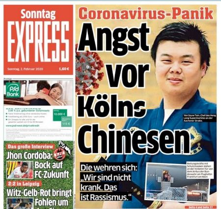
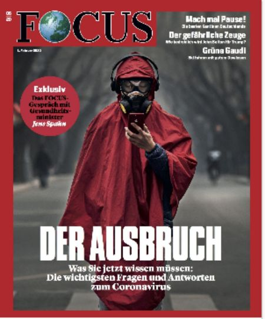
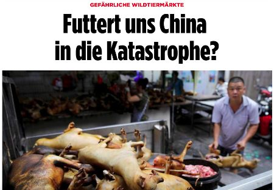

[Andere Aktivitäten auf *Gut Deutsch
online*](https://daniel-jach.github.io/gutDeutsch-online/index.html)

# Framing und Corona

<table>
<tbody>
<tr>
<td><b>Niveau</b> </td><td>A2</td>
</tr>
<tr>
<td><b>Dauer</b> </td><td>90 Minuten</td>
</tr>
<tr>
<td><b>Fähigkeiten<b/> </td><td>Lesen, Schreiben</td>
</tr>
<tr>
<td><b>Sprachhandlung</b> </td><td>beschreiben, Aussagen machen</td>
</tr>
<tr>
<td><b>Grammatik</b> </td><td>Adjektive ohne Artikelwörter, <i>dass<i>-Sätze</td>
</tr>
</tbody>
</table>

---

## Bilder und Wörter

***Sehen Sie die zwei Bilder an. Was fällt Ihnen ein? Ordnen Sie zu und ergänzen Sie in den Kästen.***

zusammen -- leise -- groß -- laut -- Musik -- schwer -- Instrument -- schön -- eckig -- Möbelstück -- allein -- ...

  

<textarea rows="5" style="width:45%;" float="left"></textarea> <textarea rows="5" style="width:45%;" float="right"></textarea>

<answer class="answersA" style="width:45%; float:left;">
leise -- laut -- Musik -- Instrument -- schön -- allein ... Mozart -- Lied -- Konzert -- lernen -- Noten ...
</answer>

<answer class="answersA" style="width:45%; float:right;">
zusammen -- groß -- schwer -- eckig -- Möbelstück -- zusammen -- ... Holz -- anstrengend ...
</answer>

<button onclick="showAnswersA()">Antworten anzeigen</button>

**Sie können dieselbe Sache (z.B. ein Klavier) unterschiedlich beschreiben. Umgekehrt können unterschiedliche Beschreibungen bestimmte Bilder im Kopf erzeugen. Zum Beispiel: Ich sage, dass ein Klavier schwer ist. Jetzt denken Sie an das zweite Bild. Oder ich sage, dass ein Klavier ein schönes Instrument ist. Jetzt denken Sie an das erste Bild. Die Worte beeinflussen das Denken. Das heißt *Framing*.**

---

## Was bedeutet Framing?

**Dieses Video erklärt den Begriff *Framing*. Bevor Sie das Video ansehen, lesen Sie im <a href="https://www.dwds.de/" target="_blank">Digitalen Wörterbuch der deutschen Sprache</a> die Bedeutungen der Wörter *Flüchtling, Welle, Naturkatastrophe, Gefahr, Asyl* und *Tourismus* nach.**

**Sehen Sie jetzt das Video an und machen Sie danach die Aufgaben. Wenn Sie Schwierigkeiten haben, lesen Sie im Video-Text nach.**

<video width="66%" controls>
<source src="./videos/Video-Framing.webm" type="video/webm">
Das Video funktioniert in Ihrem Browser nicht.
</video> 

Video-Text

**Framing**
      
Framing kommt vom englischen Wort Frame, und das bedeutet Rahmen. Framing soll ausdrücken, dass die Auswahl von bestimmten Worten bei einem Thema einen Rahmen vorgibt. Ein Glas ist zum Beispiel halbvoll oder halbleer. Die Information ist dieselbe, aber die Wirkung ist ganz unterschiedlich. Besonders Politiker setzen ein solches Framing oft ein. 
    
Nehmen wir ein Beispiel: Flüchtlingswelle. Auf den ersten Blick sagt uns das Wort: Viele Menschen fliehen. Doch die Verbindung von Flüchtlingen und Welle schafft einen negativen Rahmen. Die Geflüchteten werden zu einer Welle gemacht, ähnlich einer Naturkatastrophe, zu einer Gefahr für die anderen Menschen im Land. 
    
Schauen wir uns das aktuelle Streitwort an: Asyltourismus. Asyl bedeutet, dass ein Mensch in einem anderen Land um Schutz bittet. Mit dem Begriff Asyltourismus kritisieren Politiker, dass manche Geflüchtete nicht in dem Land bleiben, in dem sie Asyl beantragt haben, sondern in ein Land weiterreisen, das ihnen besser gefällt. Das Wort Tourismus erweckt allerdings den Eindruck, dass alle Geflüchtete sowas wie Urlaub machen. Doch das entspricht natürlich nicht der Wahrheit. 
    
Grundsätzlich ist Framing überhaupt nichts Schlimmes. Mit jedem Satz, den wir sagen, schaffen wir einen Rahmen, oft ohne dass wir das beabsichtigen.
    
Politiker setzen Framing allerdings sehr gezielt ein, um die Meinung der Menschen zu beeinflussen. Daher ist es wichtig, dass man immer hinterfragt, was die Politiker mit der Auswahl ihrer Worte erreichen wollen. 

*Frame* bedeutet... 
<select id="frame">
  <option style="display:none;" value=""></option>
  <option value="richtig">Rahmen</option>
  <option value="falsch">Fenster</option>
  <option value="falsch">Bild</option>
</select>.

<answer class="answersB">Rahmen</answer>

Mit *Framing* ist gemeint, dass...
<select id="framing">
  <option style="display:none;" value=""></option>
  <option value="falsch">Politiker eine besondere Sprache sprechen</option>
  <option value="falsch">Wörter genau die Wirklichkeit beschreiben</option>
  <option value="richtig">Wörter das Denken beeinflussen</option>
</select>.

<answer class="answersB">Wörter das Denken beeinflussen</answer>

Das Wort *Flüchtlingswelle* beschreibt Flüchtlinge als...
<select id="welle">
  <option style="display:none;" value=""></option>
  <option value="falsch">fremde, aber freundliche Menschen</option>
  <option value="richtig">bedrohliche Naturkatastrophe</option>
  <option value="falsch">gute und schnelle Schwimmer</option>
</select>.

<answer class="answersB">bedrohliche Naturkatastrophe</answer>

Das Wort *Asyltourismus* erzeugt das Bild von Asyl als...
<select id="tourismus">
  <option style="display:none;" value=""></option>
  <option value="richtig">angenehmem und relaxtem Camping-Urlaub</option>
  <option value="falsch">wichtigem Schutz für verfolgte Menschen</option>
  <option value="falsch">anstrengender und schwieriger Reise</option>
</select>.

<answer class="answersB">angenehmem und relaxtem Camping-Urlaub</answer>

<button onclick="showAnswersB()">Antworten anzeigen</button>

---

## Chinesen im Corona-Frame

**In der Corona-Zeit im Jahr 2020 haben Medien und Politik die Chinesen und China oft in einem Corona-Rahmen beschrieben. Zum Beispiel hat der US-amerikanische Präsident Donald Trump gesagt, dass das Corona-Virus das "China-Virus" ist. Die Internetseite [www.korientation.de](https://www.korientation.de/corona-rassismus-medien/) hat von Januar bis Mai 2020 deutschsprachige Zeitungen und Internetseiten durchsucht, Bilder gesammelt und Notizen gemacht.**

**Sehen Sie die Bilder an und lesen Sie die Bildbeschreibungen. Ergänzen Sie das beim Leser erzeugte Framing.**

 

28.01.2020 Abendzeitung München 
Asiatische Frau mit großem Mundschutz 
Bericht über gefährliche Krankheit mit großem Bild von asiatischer Frau unten, kleine Überschrift &bdquo;Gefährliche Lungenseuche&ldquo; und große Überschrift &bdquo;Angst vor Corona&ldquo; oben

 
Was denkt der Leser? Der Leser denkt, dass asiatische Frauen eine Gefahr für andere Menschen sind. 

30.01.2020 Bild-Zeitung 
Asiatische Menschen bei Feuertopf-Essen 
Bericht über schnelle Ausbreitung von Corona in Deutschland, Bild zeigt asiatische Familie bei gemeinsamem Essen an rundem Tisch in traditionellem Restaurant

 
Was denkt der Leser? Ergänzen Sie. <textarea rows="2" style="width:100%;">Der Leser denkt, dass </textarea>

<answer class="answersC">(Mögliche Antwort) Der Leser denkt, dass sich die ersten Chinesen beim Essen mit dem Corona-Virus angesteckt haben und dass in China das Essen nicht sauber ist.</answer>

30.01.2020 Bild-Zeitung 
Chinesische Glückskekse 
Bericht über neues Corona-Virus im Zusammenhang mit asiatischen Lebensmitteln, Bild von chinesischen Süßigkeiten

 
Was denkt der Leser? Ergänzen Sie. <textarea rows="2" style="width:100%;"></textarea>

<answer class="answersC">(Mögliche Antwort) Der Leser denkt, dass chinesisches Essen und andere Produkte das Corona-Virus übertragen.</answer>

01.02.2020 Spiegel 
Asiatische Person in rotem Umhang und mit großer Schutzbrille und Gasmaske 
Rotes Heft über weltweite Corona-Epidemie und mögliche Folgen für globale Wirtschaft mit &bdquo;Made in China&ldquo; in gelber Schrift und kleinem Untertitel &bdquo;Wenn die Globalisierung zur tödlichen Gefahr wird&ldquo;, grauer Hintergrund steht für dichten Smog

 
Was denkt der Leser? Ergänzen Sie. <textarea rows="2" style="width:100%;"></textarea>

<answer class="answersC">(Mögliche Antwort) Der Leser denkt, dass Corona ein Problem im Sozialismus ist (rote Farbe), und vielleicht, dass die Chinesen dumm sind, weil sie immer auf's Handy schauen.</answer>

02.02.2020 Sonntag Express 
Asiatischer Mann neben riesigem Virus 
Bericht über neuartiges Virus zeigt chinesischen Mann und großen Text &bdquo;Angst vor Kölns Chinesen&ldquo;, daneben im Hintergrund buntes Virus

 
Was denkt der Leser? Ergänzen Sie. <textarea rows="2" style="width:100%;"></textarea>

<answer class="answersC">(Mögliche Antwort) Der Leser denkt, dass Chinesen in Köln und in Deutschland das Corona-Virus haben.</answer>

<button onclick="showAnswersC()">Antworten anzeigen</button>

---

## Adjektive ohne Artikelwörter

***Lesen Sie die Bildbeschreibungen noch einmal. Suchen Sie alle Adjektive ohne Artikelwort und ergänzen Sie die Tabelle.***

<table>
  <tbody>
  <tr><td style="vertical-align:top;">Singular</td><td style="vertical-align:top;">(der)</td><td style="vertical-align:top;">(die)</td><td style="vertical-align:top;">(das)</td></tr>
  <tr>
    <td style="vertical-align:top;">Nominativ</td>
      <td style="vertical-align:top;">
        asiatisch-<textarea rows="1" style="width:20%;"></textarea> Mann 
        <answer class="answersD">-er</answer>
      </td>
      <td>
        asiatisch-<textarea rows="1" style="width:20%;"></textarea> Frau 
        <answer class="answersD">-e</answer>
      </td>
      <td>
        bunt-<textarea rows="1" style="width:20%;"></textarea> Virus 
        <answer class="answersD">-es</answer>
      </td>
    </tr>
    <tr>
    <td style="vertical-align:top;">Akkusativ</td>
    <td>
      chinesisch-<textarea rows="1" style="width:20%;"></textarea> Mann 
      <answer class="answersD">-en</answer>
    </td>
    <td>
     asiatisch-<textarea rows="1" style="width:20%;"></textarea> Familie 
     <answer class="answersD">-e</answer>
    </td>
    <td>
      neuartig-<textarea rows="1" style="width:20%;"></textarea> Virus 
      <answer class="answersD">-es</answer>
    </td>
    </tr>  
    <tr>
    <td style="vertical-align:top;">Dativ</td>
    <td>
      rund-<textarea rows="1" style="width:20%;"></textarea> Tisch 
      <answer class="answersD">-em</answer>
    </td>
    <td>
      gelb-<textarea rows="1" style="width:20%;"></textarea> Schrift 
      <answer class="answersD">-er</answer>
    </td>
    <td>
      groß-<textarea rows="1" style="width:20%;"></textarea> Bild 
      <answer class="answersD">-em</answer>
    </td>
    </tr>
  </tbody>
</table>

<table>
  <tbody>
    <tr>
      <td style="vertical-align:top;">Plural</td><td style="vertical-align:top;">(die)</td>
    </tr>
    <tr>
      <td style="vertical-align:top;">Nominativ/ Akkusativ</td>
      <td>
      chinesisch-<textarea rows="1" style="width:20%;"></textarea> Glückskekse 
      <answer class="answersD">-e</answer>
      </td>
    </tr>
    <tr>
    <td style="vertical-align:top;">Dativ</td>
      <td>
      chinesisch-<textarea rows="1" style="width:20%;"></textarea> Süßigkeiten 
      <answer class="answersD">-en</answer>
      </td>
    </tr>  
  </tbody>
</table>

<button onclick="showAnswersD()">Antworten anzeigen</button>

---

## Mehr Bilder, mehr Framing -- Beschreiben Sie!

***Beschreiben Sie die folgenden Bilder und Texte von [www.korientation.de](https://www.korientation.de/corona-rassismus-medien/) und ihr Framing.***

24.04.2020, Frankfurter Allgemeine Zeitung 
<textarea rows="15" style="width:100%; float:right;"></textarea>

06.04.2020, Bild 
<textarea rows="15" style="width:100%; float:right;"></textarea>

17.04.2020, Tweet Frankfurter Allgemeine Zeitung 
<textarea rows="15" style="width:100%; float:right;"></textarea>

29.04.2020, Cicero 
<textarea rows="15" style="width:100%; float:right;"></textarea>

06.05.2020, Spiegel 
<textarea rows="15" style="width:100%; float:right;"></textarea>

 

