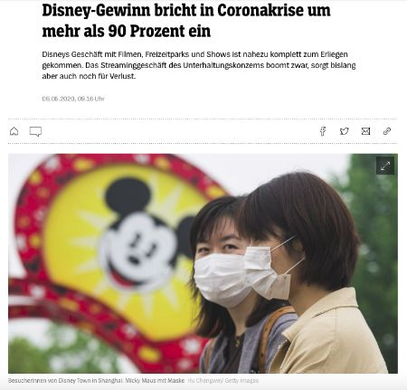

<head>

</head>

[Andere Aktivitäten auf *Gut Deutsch
online*](https://daniel-jach.github.io/gutDeutsch-online/index.html)

# Framing und Corona

---

## Was bedeutet Framing?

*Sehen Sie die zwei Bilder an. Was fällt Ihnen ein? Ergänzen Sie die Bildunterschriften.*

| Bild 1 | Bild 2 |
|:-------------------------:|:-------------------------:|
| | |
|<input id="piano-play" placeholder="Ich denke, dass ein Klavier ... ist." type="text" style="width:100%;"> | <input id="piano-move" placeholder="Ich denke, dass ein Klavier ... ist." type="text" style="width:100%;"> |

*Sie können dieselbe Sache (z.B. ein Klavier) unterschiedlich beschreiben. Umgekehrt können unterschiedliche Beschreibungen bestimmte Bilder im Kopf erzeugen. Ich sage z.B., dass ein Klavier schwer ist. Jetzt denken Sie an Bild 2. Oder ich sage, dass ein Klavier ein schönes Instrument ist. Jetzt denken Sie an Bild 1. Die Worte beeinflussen das Denken. Das heißt* Framing*.*

*Dieses Video erklärt den Begriff* Framing *. Bevor Sie das Video ansehen, sehen Sie im <a href="https://www.dwds.de/" target="_blank">Digitalen Wörterbuch der deutschen Sprache</a> die Bedeutung der Wörtern* Flüchtling, Welle, Naturkatastrophe, Gefahr, Asyl *und* Tourismus *nach.*

<video width="320" height="240" controls>
<source src="./videos/Video-Framing.webm" type="video/webm">
Das Video funktioniert in Ihrem Browser nicht.
</video> 

Video-Text

**Framing**
      
Framing kommt vom englischen Wort Frame, und das bedeutet Rahmen. Framing soll ausdrücken, dass die Auswahl von bestimmten Worten bei einem Thema einen Rahmen vorgibt. Ein Glas ist zum Beispiel halbvoll oder halbleer. Die Information ist dieselbe, aber die Wirkung ist ganz unterschiedlich. Besonders Politiker setzen ein solches Framing oft ein. 
    
Nehmen wir ein Beispiel: Flüchtlingswelle. Auf den ersten Blick sagt uns das Wort: Viele Menschen fliehen. Doch die Verbindung von Flüchtlingen und Welle schafft einen negativen Rahmen. Die Geflüchteten werden zu einer Welle gemacht, ähnlich einer Naturkatastrophe, zu einer Gefahr für die anderen Menschen im Land. 
    
Schauen wir uns das aktuelle Streitwort an: Asyltourismus. Asyl bedeutet, dass ein Mensch in einem anderen Land um Schutz bittet. Mit dem Begriff Asyltourismus kritisieren Politiker, dass manche Geflüchtete nicht in dem Land bleiben, in dem sie Asyl beantragt haben, sondern in ein Land weiterreisen, das ihnen besser gefällt. Das Wort Tourismus erweckt allerdings den Eindruck, dass alle Geflüchtete sowas wie Urlaub machen. Doch das entspricht natürlich nicht der Wahrheit. 
    
Grundsätzlich ist Framing überhaupt nichts Schlimmes. Mit jedem Satz, den wir sagen, schaffen wir einen Rahmen, oft ohne dass wir das beabsichtigen.
    
Politiker setzen Framing allerdings sehr gezielt ein, um die Meinung der Menschen zu beeinflussen. Daher ist es wichtig, dass man immer hinterfragt, was die Politiker mit der Auswahl ihrer Worte erreichen wollen. 

*Wählen Sie die richtigen Aussagen zum Video aus. Wenn Sie Schwierigkeiten haben, lesen Sie im Video-Text nach.* 

*Frame* bedeutet...
<select id="frame">
  <option style="display:none;" value="">Wählen Sie die richtige Aussage aus.</option>
  <option value="richtig">Rahmen</option>
  <option value="falsch">Fenster</option>
  <option value="falsch">Bild</option>
</select>

Mit *Framing* ist gemeint, dass...
<select id="framing">
  <option style="display:none;" value="">Wählen Sie die richtige Aussage aus.</option>
  <option value="falsch">Politiker eine besondere Sprache sprechen</option>
  <option value="falsch">Wörter genau die Wirklichkeit beschreiben</option>
  <option value="richtig">Wörter das Denken beeinflussen</option>
</select>

Das Wort *Flüchtlingswelle* beschreibt Flüchtlinge als...
<select id="welle">
  <option style="display:none;" value="">Wählen Sie die richtige Aussage aus.</option>
  <option value="falsch">fremde, aber freundliche Menschen</option>
  <option value="richtig">bedrohliche Naturkatastrophe</option>
  <option value="falsch">gute und schnelle Schwimmer</option>
</select>

Das Wort *Asyltourismus* erzeugt das Bild von Asyl als...
<select id="tourismus">
  <option style="display:none;" value="">Wählen Sie die richtige Aussage aus.</option>
  <option value="richtig">angenehmem und relaxtem Camping-Urlaub</option>
  <option value="falsch">wichtigem Schutz für verfolgte Menschen</option>
  <option value="falsch">anstrengender und schwieriger Reise</option>
</select>

---

## Chinesen im Corona-Frame

*In der Corona-Zeit im Jahr 2020 haben Medien und Politik die Chinesen und China oft in einem Corona-Frame beschrieben. Zum Beispiel hat der US-amerikanische Präsident Donald Trump gesagt, dass das Corona-Virus das* China-Virus *ist. Die Internetseite [www.korientation.de](https://www.korientation.de/corona-rassismus-medien/) hat von Januar bis Mai 2020 deutschsprachige Zeitungen und Internetseiten durchsucht und Bilder gesammelt.* 

<table>
  <tbody>
    <tr>
      <td> 
        
      </td>
      <td>
      **Asiatische Frau mit großem Mundschutz**  
      Am 28.01.2020 berichtet [Abendzeitung München](https://www.abendzeitung-muenchen.de/muenchen/angst-vor-coronavirus-atemmasken-in-muenchen-ausverkauft-art-486707) über gefährliche Krankheit mit großem Bild von asiatischer Frau mit Mundschutz. Kleine Überschrift *Gefährliche Lungenseuche*, große Überschrift *Angst vor Corona*.
 
 
Was denkt der Leser? Der Leser denkt, dass asiatische Frauen eine Gefahr für andere Menschen sind. 
      </td>
    </tr>
    <tr>
      <td>
        
      </td>
      <td>
      **Asiatische Menschen bei gemeinsamem Essen**  
      Am 30.01.2020 berichtet [Bild-Zeitung](https://www.bild.de/bild-plus/news/inland/news-inland/eingeschleppt-von-einer-chinesischen-webasto-mitarbeiterin-so-kam-das-corona-vir-67649244,view=conversionToLogin.bild.html) über schnelle Ausbreitung von Corona in Deutschland und zeigt asiatische Menschen beim Feuertopf-Essen in traditionellem Restaurant.
 
 
Was denkt der Leser? Ergänzen Sie. <input id="image-2" placeholder="Der Leser denkt, dass..." type="text" style="width:50%;"> 
      </td>
    </tr>
    <tr>
      <td>
        
      </td>
      <td>
      **Chinesische Glückskekse**  
      Am 30.01.2020 berichtet [Bild-Zeitung](https://www.bild.de/bild-plus/ratgeber/gesundheit/gesundheit/corona-gefahr-durch-asia-essen-kann-ich-noch-glueckskekse-essen-67657122,view=conversionToLogin.bild.html?utm_source=headtopics&utm_medium=news&utm_campaign=2020-01-30) über neues Corona-Virus im Zusammenhang mit asiatischen Lebensmitteln. Bild von chinesischen Glückskeksen.
 
 
Was denkt der Leser? Ergänzen Sie. <input id="image-3" placeholder="Der Leser denkt, dass..." type="text" style="width:50%;"> 
      </td>
    </tr>
    <tr>
      <td>
        
      </td>
      <td>
      **Asiatische Person mit rotem Umhang, Kopfhörern, Handy und großer Schutzbrille und Gasmaske**  
      Am 01.02.2020 berichtet [Spiegel](https://www.spiegel.de/politik/ausland/coronavirus-wenn-die-globalisierung-zur-toedlichen-gefahr-wird-a-00000000-0002-0001-0000-000169240263) über neue Corona-Epidemie und mögliche Folgen für weltweite Wirtschaft mit *Made in China* in gelber Schrift und kleiner Untertitel *tödliche Gefahr*. Grauer Hintergrund steht für dichten Smog.
 
 
Was denkt der Leser? Ergänzen Sie. <input id="image-5" placeholder="Der Leser denkt, dass..." type="text" style="width:50%;"> 
      </td>
    </tr>
    <tr>
      <td>
        
      </td>
      <td>
      **Asiatischer Mann mit riesigem Virus**  
      Am 02.02.2020 berichtet [Sonntag Express](https://www.spiegel.de/politik/ausland/coronavirus-wenn-die-globalisierung-zur-toedlichen-gefahr-wird-a-00000000-0002-0001-0000-000169240263) über Corona und zeigt chinesischen Mann und großen schwarzen Text *Angst vor Kölns Chinesen*. Buntes Virus im Hintergrund.
 
 
Was denkt der Leser? Ergänzen Sie. <input id="image-5" placeholder="Der Leser denkt, dass..." type="text" style="width:50%;"> 
      </td>
    </tr>
  </tbody>
</table>

---

## Adjektive ohne Artikelwörter

*Lesen Sie die Bildbeschreibungen noch einmal. Suchen Sie alle Adjektive ohne Artikelwort und schreiben Sie Adjektive und Nomen an der richtigen Stelle in die Tabelle.*

<table>
  <tbody>
  <tr><td><b>Singular</b></td><td>(<i>der</i>)</td><td>(<i>die</i>)</td><td>(<i>das</i>)</td></tr>
  <tr>
    <td><b>Nominativ</b></td>
      <td><textarea id="" rows="5" style="width:100%;">asiatischer Mann</textarea></td>
      <td><textarea id="" rows="5" style="width:100%;">asiatische Frau</textarea></td>
      <td><textarea id="" rows="5" style="width:100%;"></textarea></td>
    </tr>
    <tr>
    <td><b>Akkusativ</b></td>
      <td><textarea id="" rows="5" style="width:100%;"></textarea></td>
      <td><textarea id="" rows="5" style="width:100%;"></textarea></td>
      <td><textarea id="" rows="5" style="width:100%;"></textarea></td>
    </tr>  
    <tr>
    <td><b>Dativ</b></td>
      <td><textarea id="" rows="5" style="width:100%;">großem Mundschutz</textarea></td>
      <td><textarea id="" rows="5" style="width:100%;"></textarea></td>
      <td><textarea id="" rows="5" style="width:100%;"></textarea></td>
    </tr>  
    <tr>
    <td><b>Plural</b></td><td>(<i>die</i>)</td><td></td><td></td>
    </tr>
    <tr>
    <td><b>Nominativ/Akkusativ</b></td>
      <td><textarea id="" rows="5" style="width:100%;"></textarea></td>
      <td></td>
      <td></td>
    </tr>
    <tr>
    <td><b>Dativ</b></td>
      <td><textarea id="" rows="5" style="width:100%;"></textarea></td>
      <td></td>
      <td></td>
    </tr>  
    </tr>  
  </tbody>
</table>

*Vergleichen Sie jetzt die Einträge in der Tabelle. Notieren Sie dann die Endungen der Adjektive hier.*

<table>
  <tbody>
  <tr><td><b>Singular</b></td><td>(<i>der</i>)</td><td>(<i>die</i>)</td><td>(<i>das</i>)</td></tr>!
  <tr>
    <td><b>Nominativ</b></td>
      <td><textarea id="" rows="1" style="width:100%;">-er</textarea></td>
      <td><textarea id="" rows="1" style="width:100%;">-e</textarea></td>
      <td><textarea id="" rows="1" style="width:100%;"></textarea></td>
    </tr>
    <tr>
    <td><b>Akkusativ</b></td>
      <td><textarea id="" rows="1" style="width:100%;"></textarea></td>
      <td><textarea id="" rows="1" style="width:100%;"></textarea></td>
      <td><textarea id="" rows="1" style="width:100%;"></textarea></td>
    </tr>  
    <tr>
    <td><b>Dativ</b></td>
      <td><textarea id="" rows="1" style="width:100%;">-em</textarea></td>
      <td><textarea id="" rows="1" style="width:100%;"></textarea></td>
      <td><textarea id="" rows="1" style="width:100%;"></textarea></td>
    </tr>  
    <tr>
    <td><b>Plural</b></td><td>(<i>die</i>)</td><td></td><td></td>
    </tr>
    <tr>
    <td><b>Nominativ/Akkusativ</b></td>
      <td><textarea id="" rows="1" style="width:100%;"></textarea></td>
      <td></td>
      <td></td>
    </tr>
    <tr>
    <td><b>Dativ</b></td>
      <td><textarea id="" rows="1" style="width:100%;"></textarea></td>
      <td></td>
      <td></td>
    </tr>  
    </tr>  
  </tbody>
</table>

---

## Mehr Bilder, mehr Framing -- Beschreiben Sie.

*Beschreiben Sie die folgenden Bilder von [www.korientation.de](https://www.korientation.de/corona-rassismus-medien/) und ihr Framing.* 

<table>
  <tbody>
    <tr>
      <td> 
        
      </td>
      <td>
      02.04.2020, [Spiegel](https://www.spiegel.de/wissenschaft/medizin/coronavirus-weltweit-mehr-als-eine-million-menschen-infiziert-a-cbfe5cc5-2f90-4742-a86f-fe87b29ea801) 
      <textarea id="" rows="5" style="width:100%;"></textarea>
      </td>
    </tr>
    <tr>
      <td>
        
      </td>
      <td>
      06.04.2020, Bild-Zeitung
      <textarea id="" rows="5" style="width:100%;"></textarea>
      </td>
    </tr>
    <tr>
      <td>
        
      </td>
      <td>
      17.04.2020, [Tweet Frankfurter Allgemeine Zeitung](https://twitter.com/faznet/status/1251232975712329728)
      <textarea id="" rows="5" style="width:100%;"></textarea>
      </td>
    </tr>
    <tr>
      <td>
        
      </td>
      <td>
      29.04.2020, [Cicero](https://www.cicero.de/)
      <textarea id="" rows="5" style="width:100%;"></textarea>
      </td>
    </tr>
    <tr>
      <td>
        
      </td>
      <td>
      06.05.2020, [Spiegel](https://www.spiegel.de/consent-a-?targetUrl=https%3A%2F%2Fwww.spiegel.de%2Fwirtschaft%2Funternehmen%2Fdisney-gewinn-bricht-in-coronakrise-um-mehr-als-90-prozent-ein-a-f8f8faa4-5c5f-41f4-b896-5483c9ef5431)
      <textarea id="" rows="5" style="width:100%;"></textarea>
      </td>
    </tr>
  </tbody>
</table>

