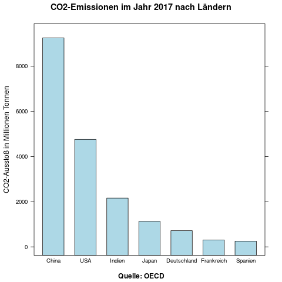
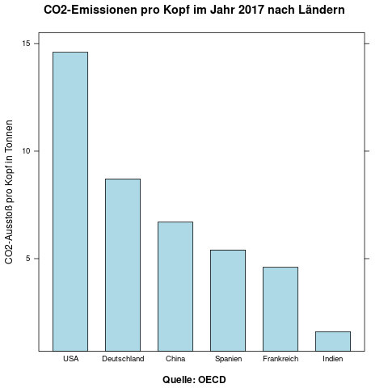
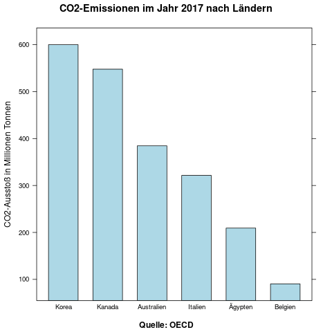
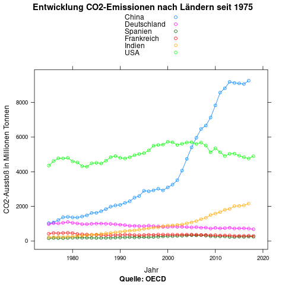
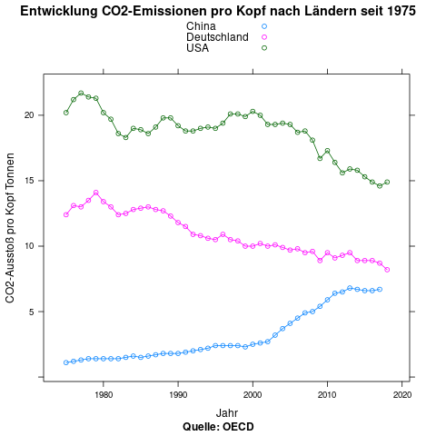
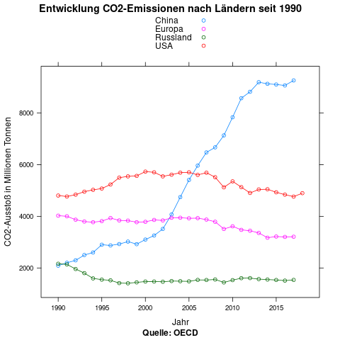
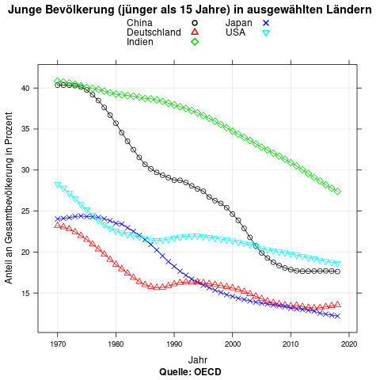

```{r setup, echo=FALSE}
knitr::opts_chunk$set(echo = TRUE)
```

<head>
<style>
details > summary {
  cursor: pointer;
}

details > div {
  border: 1px solid lightblue;
  padding: 4px;
}
</style>
</head>


[Andere Aktivitäten auf *Gut Deutsch online*](https://daniel-jach.github.io/gutDeutsch-online/index.html)

# Grafikbeschreibung

|  |  |
|------|------|
|**Niveau**|B1-B2|
|**Dauer**|90 Minuten| 
|**Fähigkeiten**|Hören, Schreiben|
|**Sprachhandlung**|Grafik beschreiben|
|**Textsorte**|Grafikbeschreibung|

***

***Aufgabe 1***  
*Bilden Sie kleine Gruppen. Lesen und korrigieren Sie Ihre Hausaufgaben-Texte in der Gruppe. Achten Sie dabei besonders darauf, dass alle wichtigen Bestandteile der Grafik benannt sind (Titel, Quelle, Zeitraum, Parameter), und markieren Sie Überleitungen.*

***

```{r Grafik-Emissionen, echo=FALSE, include=FALSE}
df<-read.csv("./data/data-emissions.csv", stringsAsFactors = TRUE)
df<-df[df$LOCATION %in% c("CHN", "USA", "DEU", "FRA", "ESP", "JPN", "IND"),]
df<-df[df$TIME == "2017",]
df<-df[df$SUBJECT == "CO2",]
df<-df[df$MEASURE == "MLN_TONNE",]
df<-df[,c("LOCATION", "Value")]
df<-droplevels(df)
levels(df$LOCATION)<-c("China", "Deutschland", "Spanien", "Frankreich", "Indien", "Japan", "USA")
df$LOCATION<-reorder(df$LOCATION, -df$Value)

library(lattice)

png("./images/Grafik-Emissionen.png")
barchart(df$Value ~ df$LOCATION,
       main = "CO2-Emissionen im Jahr 2017 nach Ländern",
       ylab = "CO2-Ausstoß in Millionen Tonnen",
       sub = "Quelle: OECD", 
       col = "lightblue")
dev.off()
```

***Aufgabe 2***  
***a** Hören Sie die folgende Grafikbeschreibung an und zeichnen Sie die beschriebene Grafik.* 

<audio controls id="meinAudio" src="./audios/Grafik-CO2-Emissionen-Audio.mp3" preload="auto"></audio>

***b** Vergleichen Sie dann Ihre Zeichnung mit den Zeichnungen Ihrer Gruppenmitglieder. Bei Uneinigkeit lesen Sie im Transkript nach.*

<details><summary>Transkript</summary><div>
**Erderwärmung**

Die Erde wird sich in den nächsten Jahren stark erwärmen. Eine wichtige Ursache für diese Entwicklung ist der Anstieg von CO2 in der Atmosphäre. Wissenschaftler und Bürgerinnen fordern daher, dass der CO2-Ausstoß global gesenkt wird. Manche Volkswirtschaften produzieren aber mehr CO2 als andere. Die folgende Grafik vergleicht den CO2-Ausstoß ausgewählter Länder im Jahr 2017. Die Daten stammen von der OECD.

Die Grafik zeigt die Länder China, USA, Indien, Japan, Deutschland, Frankreich und Spanien auf der horizontalen Achse, und ihren CO2-Ausstoß in Millionen Tonnen auf der vertikalen Achse. Der CO2-Ausstoß jedes Landes wird als Balken dargestellt. Je höher der Balken ist, umso mehr CO2 produziert dieses Land. 

China produziert mit über 8000 Millionen Tonnen deutlich mehr CO2 als die anderen Länder. An zweiter Stelle folgen die USA mit etwa 5000 Millionen Tonnen. Indien, Chinas Nachbarland, liegt mit etwa 2000 Millionen Tonnen CO2-Ausstoß auf dem dritten Platz. Danach folgen Japan und Deutschland mit etwa 1000 bzw. 700 Millionen Tonnen. Frankreich und Spanien produzieren beide weniger als 500 Millionen Tonnen CO2. 

Die Zahlen zeigen einen eindeutigen Zusammenhang zwischen Bevölkerungszahl und CO2-Ausstoß: Je größer die Bevölkerung eines Landes ist, desto größer ist auch sein CO2-Ausstoß. Eine Ausnahme bildet Indien, das trotz größerer Bevölkerung weniger CO2 produziert als die USA. Das hat möglicherweise mit der geringeren Industrialisierung der indischen Wirtschaft und weniger motorisiertem Individualverkehr zu tun. Der immense CO2-Ausstoß Chinas wird vermutlich von der großen Bevölkerung und der relativ späten Industrialisierung verursacht. Dagegen produzieren Länder mit relativ kleinen Bevölkerungen und überwiegend postindustrieller Wirtschaft wie Deutschland, Frankreich und Spanien vergleichsweise wenig CO2.
</div></details>

***c** Vergleichen Sie jetzt Ihre Grafiken mit der Grafik. Bei Unterschieden lesen Sie die schwierigen Stellen im Transkript noch einmal und verbessern Ihre Grafik.*

<details><summary>Grafik</summary><div>

</div></details>

***d** Hören und lesen Sie die Beschreibung noch einmal und beschriften Sie die Bestandteile Ihrer Grafik.*

***e** Hören und lesen Sie die Beschreibung ein letztes Mal und notieren Sie Ausdrücke, die einen Vergleich ausdrücken.* 

***f** Die Beschreibung ist zu lang. Kürzen Sie die Beschreibung, indem Sie sich auf die wichtigsten Daten und Vergleiche beschränken.*

*** 

***Aufgabe 3**  
Wählen Sie **eine** der folgenden Grafiken aus (Grafik A oder B) und formulieren Sie eine Beschreibung in der Gruppe.*

```{r Grafik-Emissionen-A, echo=FALSE, include=FALSE}
df<-read.csv("./data/data-emissions.csv", stringsAsFactors = TRUE)
df<-df[df$LOCATION %in% c("CHN", "USA", "DEU", "FRA", "ESP", "JAP", "IND"),]
df<-df[df$TIME == "2017",]
df<-df[df$SUBJECT == "CO2",]
df<-df[df$MEASURE == "TONNE_CAP",]
df<-df[,c("LOCATION", "Value")]
df<-droplevels(df)
levels(df$LOCATION)<-c("China", "Deutschland", "Spanien", "Frankreich", "Indien", "USA")
df$LOCATION<-reorder(df$LOCATION, -df$Value)

library(lattice)
png("./images/Grafik-Emissionen-A.png")
barchart(df$Value ~ df$LOCATION,
       main = "CO2-Emissionen pro Kopf im Jahr 2017 nach Ländern",
       ylab = "CO2-Ausstoß pro Kopf in Tonnen",
       sub = "Quelle: OECD", 
       col = "lightblue")
dev.off()
```

```{r Grafik-Emissionen-B, echo=FALSE, include=FALSE}
df<-read.csv("./data/data-emissions.csv", stringsAsFactors = TRUE)
df<-df[df$LOCATION %in% c("AUS", "BEL", "CAN", "EGY", "KOR", "ITA"),]
df<-df[df$TIME == "2017",]
df<-df[df$SUBJECT == "CO2",]
df<-df[df$MEASURE == "MLN_TONNE",]
df<-df[,c("LOCATION", "Value")]
df<-droplevels(df)
levels(df$LOCATION)<-c("Australien", "Belgien", "Kanada", "Ägypten", "Italien", "Korea")
df$LOCATION<-reorder(df$LOCATION, -df$Value)

library(lattice)

png("./images/Grafik-Emissionen-B.png")
barchart(df$Value ~ df$LOCATION,
       main = "CO2-Emissionen im Jahr 2017 nach Ländern",
       ylab = "CO2-Ausstoß in Millionen Tonnen",
       sub = "Quelle: OECD", 
       col = "lightblue")
dev.off()
```

<details><summary>Grafik A</summary><div>


</div></details>

<details><summary>Grafik B</summary><div>


</div></details>

*** 

***Aufgabe 4**  
Schicken Sie ein Mitglied Ihrer Gruppe mit der Beschreibung in eine andere Gruppe. Lesen Sie die Beschreibung Ihrer Gruppe vor bzw. hören Sie die Beschreibung der anderen Gruppe und zeichnen Sie die andere Grafik. Diskutieren und verbessern Sie die Grafikbeschreibung. Teilen Sie die Verbesserungsvorschläge mit Ihrer Gruppe.* 

*** 

***Aufgabe 5** Wiederholen Sie die Aufgaben 1 bis 4 mit folgenden Grafiken. In Aufgabe 2 e notieren Sie Ausdrücke, die eine Entwicklung ausdrücken. In Aufgabe 2 f beschränken Sie sich auf die wichtigsten Daten und Entwicklungen.*

```{r Grafik-Emissionen-Entwicklung, echo=FALSE, include=FALSE}
df<-read.csv("./data/data-emissions.csv", stringsAsFactors = TRUE)
df<-df[df$LOCATION %in% c("CHN", "USA", "DEU", "FRA", "ESP", "JAP", "IND"),]
df<-df[df$SUBJECT == "CO2",]
df<-df[df$TIME >= 1975,]
df<-df[df$MEASURE == "MLN_TONNE",]
df<-df[,c("LOCATION", "TIME", "Value")]
df<-droplevels(df)
levels(df$LOCATION)<-c("China", "Deutschland", "Spanien", "Frankreich", "Indien", "USA")

library(lattice)

png("./images/Grafik-Emissionen-Entwicklung.png")
xyplot(df$Value ~ df$TIME, groups = df$LOCATION,
       type = c("b"),
       main = "Entwicklung CO2-Emissionen nach Ländern seit 1975",
       ylab = "CO2-Ausstoß in Millionen Tonnen",
       xlab = "Jahr",
       sub = "Quelle: OECD", 
       auto.key = TRUE)
dev.off()
```

<div>
<audio controls id="meinAudio" src="./audios/Grafik-CO2-Emissionen-Entwicklung-Audio.mp3" preload="auto"></audio>
</div>

<details>
<summary>Transkript</summary><div>

**Erderwärmung**

Die Erde wird sich in den nächsten Jahren stark erwärmen. Eine wichtige Ursache für diese Entwicklung ist der Anstieg von CO2 in der Atmosphäre. Der CO2-Ausstoß entwickelt sich in unterschiedlichen Volkswirtschaften verschieden. Die Grafik liefert genaue Informationen über die Entwicklung der CO2-Emissionen seit dem Jahr 1975 in verschiedenen Ländern. 

Auf der horizontalen Achse sind die Jahreszahlen seit 1975 eingetragen, auf der vertikalen Achse der CO2-Ausstoß in Millionen Tonnen. Verschiedenfarbige Punkte und Linien zeigen den jährlichen CO2-Ausstoß verschiedener Länder und seine Entwicklung über die Zeit an. Dargestellt sind die Länder China, USA, Deutschland, Spanien, Frankreich und Indien. Die Daten kommen von der OECD.

Eine wesentliche Entwicklung zeigt sich bei nur einem Land: China. Von 1975 bis in die Gegenwart steigt sein CO2-Ausstoß von unter 2000 Millionen Tonnen auf über 8000 Millionen Tonnen an. Vor allem ab dem Jahr 2000 zeigt sich ein rasanter Anstieg, der erst nach 2010 auf hohem Niveau wieder abflacht. Seit Mitte der 2000er Jahre produziert China mehr CO2 als die USA. Die USA liegen über den gesamten Zeitraum hinweg durchgehend bei über 4000 Millionen Tonnen CO2-Ausstoß, eine wesentliche Veränderung zeigt sich nicht. 

Der CO2-Ausstoß dieser beiden Länder liegt durchschnittlich deutlich höher als der von Deutschland, Frankreich, Spanien und Indien. Der CO2-Ausstoß der europäischen Länder liegt durchgehend bei unter 2000 Millionen Tonnen und sinkt langsam, aber kontinuierlich ab. In Indien steigt der CO2-Ausstoß dagegen seit Ende der 2000er Jahre an und liegt im Moment bei etwa 2000 Millionen Tonnen.  

Besonders bemerkenswert ist die Entwicklung in China. Der rasante Anstieg wird vermutlich von der neueren industriellen Entwicklung und einer wachsenden Bevölkerung verursacht. Auch der Anstieg in Indien wird vermutlich von Wirtschafts- und Bevölkerungswachstum bedingt. Die kleineren europäischen Länder haben ihren CO2-Ausstoß zwar gesenkt, können den Anstieg in China und Indien und den unverändert hohen US-amerikanischen CO2-Ausstoß aber nicht ausgleichen. Wenn sich diese Entwicklung fortsetzt, wird sich die Erde weiter erwärmen. 
</div></details>

<details><summary>Grafik</summary><div>

</div></details>

```{r Grafik-Emissionen-Entwicklung-A, echo=FALSE, include=FALSE}
df<-read.csv("./data/data-emissions.csv", stringsAsFactors = TRUE)
df<-df[df$LOCATION %in% c("CHN", "USA", "DEU"),]
df<-df[df$SUBJECT == "CO2",]
df<-df[df$TIME >= 1975,]
df<-df[df$MEASURE == "TONNE_CAP",]
df<-df[,c("LOCATION", "TIME", "Value")]
df<-droplevels(df)
levels(df$LOCATION)<-c("China", "Deutschland", "USA")

library(lattice)

png("./images/Grafik-Emissionen-Entwicklung-A.png")
xyplot(df$Value ~ df$TIME, groups = df$LOCATION,
       type = c("b"),
       main = "Entwicklung CO2-Emissionen pro Kopf nach Ländern seit 1975",
       ylab = "CO2-Ausstoß pro Kopf Tonnen",
       xlab = "Jahr",
       sub = "Quelle: OECD", 
       auto.key = TRUE)
dev.off()
```

```{r Grafik-Emissionen-Entwicklung-B, echo=FALSE, include=FALSE}
df<-read.csv("./data/data-emissions.csv", stringsAsFactors = TRUE)
df<-df[df$LOCATION %in% c("CHN", "EU28", "RUS", "USA"),]
df<-df[df$SUBJECT == "CO2",]
df<-df[df$TIME >= 1990,]
df<-df[df$MEASURE == "MLN_TONNE",]
df<-df[,c("LOCATION", "TIME", "Value")]
df<-droplevels(df)
levels(df$LOCATION)<-c("China", "Europa", "Russland", "USA")

library(lattice)

png("./images/Grafik-Emissionen-Entwicklung-B.png")
xyplot(df$Value ~ df$TIME, groups = df$LOCATION,
       type = c("b"),
       main = "Entwicklung CO2-Emissionen nach Ländern seit 1990",
       ylab = "CO2-Ausstoß in Millionen Tonnen",
       xlab = "Jahr",
       sub = "Quelle: OECD", 
       auto.key = TRUE)
dev.off()
```

<details><summary>Grafik A</summary><div>

</div></details>

<details><summary>Grafik B</summary><div>

</div></details>

*** 

```{r Grafik-junge-Population, echo=FALSE, include=FALSE}


df<-read.csv("./data/data-age.csv", stringsAsFactors = TRUE)
df<-df[df$LOCATION %in% c("CHN", "DEU", "USA", "JPN", "IND"),]
df<-df[,c("LOCATION", "TIME", "Value")]
df<-droplevels(df)
levels(df$LOCATION)<-c("China", "Deutschland", "Indien", "Japan", "USA")
library(lattice)

png("./images/Grafik-Alter-Entwicklung.png")
xyplot(df$Value ~ df$TIME, groups = df$LOCATION,
       type = c("b", "g"),
       main = "Junge Bevölkerung (jünger als 15 Jahre) in ausgewählten Ländern",
       col = 1:5,
       pch = c(1,2,5,4,6),
       cex = 1,
       lwd = 1,
       xlab = "Jahr", 
       ylab = "Anteil an Gesamtbevölkerung in Prozent",
       sub = "Quelle: OECD",
       key = list(columns=2,
                  text = list(levels(df$LOCATION)),
                  points = list(pch = c(1,2,5,4,6), col = 1:5, lwd = 2)))
dev.off()
```


***Hausaufgaben***  
*In allen Industriegesellschaften wird die Bevölkerung immer älter. Das hat schwerwiegende Folgen für die Wirtschaftskraft und die sozialstaatlichen Institutionen dieser Gesellschaften. Beschreiben Sie die folgende Grafik.*

<details><summary>Grafik</summary><div>

</div></details>
