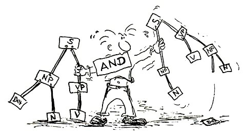

<head>
    <base target="_blank">
</head>

<a href="./../index.html" target="_self">Andere Aktivitäten auf *Gut Deutsch
online*</a>

# Einführung in die Sprachwissenschaft

#### Beschreibung

Dieser Kurs führt in die Grundlagen der Linguistik in ihren großen Teilbereich ein: Semiotik, Semantik, Pragmatik, Textlinguistik, Phonetik/Phonologie, Morphologie, Syntax und Variationslinguistik. Der Kurs ist eine Kombination aus Vorlesung und Übung. Nach Einführung und Erläuterung in Form einer Video-Vorlesung haben die Studierenden anschließend im Kurs Gelegenheit, Fragen zu stellen und die eingeführten Begriffe und Ansätze in Partner- und Gruppenarbeiten anzuwenden.

#### Lernziele

Lernziele: Die Lernenden sind in der Lage, ...

* linguistische Themen und Forschungsfragen zu formulieren.
* Grundbegriffe in zentralen Bereichen der Linguistik zu definieren.
* sprachliche Daten in linguistischen Kategorien zu analysieren.
* informierte Entscheidungen über ihren weiteren Studienverlauf zu treffen.

#### Zielgruppe

Deutsch-als-Fremdsprache-Studierende im dritten Bachelor-Studienjahr

#### Aufbau

Woche|Inhalt|Downloads
-----|-------------------------|-----
1|Einführung|
2|Grundfragen und Grundbegriffe der Sprachwissenschaft|[Video](https://e1.pcloud.link/publink/show?code=XZT5eLZuRkgmJe8pWpSqfAnP6pbeSQmLMoy) - [Slides](https://e1.pcloud.link/publink/show?code=XZVT1LZ1XaYn681moyTt5pv5RHNvSYnK0OV) - [Aufgaben](https://e1.pcloud.link/publink/show?code=XZST1LZkyLtYIFzOH0Lgta8kfmgzVvg4dfV)
3|Semiotik: Theorie der Zeichen|[Video](https://e1.pcloud.link/publink/show?code=XZK5eLZ3cOe1rEkC8YKrwRl60hEOf7WsWk0) - [Slides](https://e1.pcloud.link/publink/show?code=XZ0T1LZTUtf5AdNICh0urLQfBBGpLgCJXOk) - [Aufgaben](https://e1.pcloud.link/publink/show?code=XZjT1LZyNDIGAicyWhvz5e7sYfvOVn4cBzk)
4|Semantik: Modelle sprachlicher Bedeutung|[Video](https://e1.pcloud.link/publink/show?code=XZd5eLZSBNzDDjGiWHcednEj0mkhzsGlzyy) - [Slides](https://e1.pcloud.link/publink/show?code=XZ5T1LZHXMyML8jjwmlkSvvhpSoczmI5u5k) - [Aufgaben](https://e1.pcloud.link/publink/show?code=XZuT1LZFT5l0YJqS0BLnoPr1UmGrHsqnwxy)
5|Semantik: Bedeutungsbeziehungen|[Video](https://e1.pcloud.link/publink/show?code=XZt5eLZWBOT8VasIrHlnAwN1fMj77bOUrXX) - [Slides](https://e1.pcloud.link/publink/show?code=XZJT1LZL5PWghFtGTS5t0LFEbObKhGMnafV) - [Aufgaben](https://e1.pcloud.link/publink/show?code=XZfT1LZSf7EPe1AMOhx0gLk0GybG0VEtNSk)
6|Pragmatik: Sprachliche Handlungen und Sprechakte|[Video](https://e1.pcloud.link/publink/show?code=XZ65eLZtzascr98vrRQ4jQuLHbigj2IzR87) - [Slides](https://e1.pcloud.link/publink/show?code=XZFT1LZR147AjWb1kub5QFIKDkuPXxCUJmV) - [Aufgaben](https://e1.pcloud.link/publink/show?code=XZ2T1LZytKg72mAQJuSsaTezR9TrpDVEIek)
7|Pragmatik: Indirekte Sprechakte und Implikaturen|[Video](https://e1.pcloud.link/publink/show?code=XZO5eLZ69kCX3b2SqRwzgmHPmdkLfRS1UJX) - [Slides](https://e1.pcloud.link/publink/show?code=XZpT1LZ1bC55lMdNIpAIJnL8gjayQ91Uu9y) - [Aufgaben](https://e1.pcloud.link/publink/show?code=XZWT1LZoJJt0DvOfTQCENiGErTTlLMev50k)
8|Textlinguistik: Was ist ein Text?|[Video](https://e1.pcloud.link/publink/show?code=XZ6M1LZnG2x84oA2cVumUN7sdMBqkh1tXnX) - [Slides](https://e1.pcloud.link/publink/show?code=XZHT1LZ1sE5JNDpt5Jd3b0r47mw5Qkhov7X) - [Aufgaben](https://e1.pcloud.link/publink/show?code=XZsT1LZ0zCQsfSXbPH0CrUSGNtQ0mwCMHAX)
9|Textlinguistik: Textsorten und Korpuslinguistik|[Video](https://e1.pcloud.link/publink/show?code=XZEM1LZpbNDGuN3RyLiAP3NIDfWR0nAGyOV) - [Slides](https://e1.pcloud.link/publink/show?code=XZzT1LZhRG6JCW0MOyX8bKDRM4zfps7Q9BV) - [Aufgaben](https://e1.pcloud.link/publink/show?code=XZDT1LZwPE7QzgiMfJqbv2x8YAAqBNLSTAV)
10|Phonetik und Phonologie|[Video](https://e1.pcloud.link/publink/show?code=XZOM1LZFjmHaTnumFBjezKbQPOQg7Tth0q7) - [Slides](https://e1.pcloud.link/publink/show?code=XZRT1LZRDO5gcPDaYVbu8Xdj9v7QbR5lJcV) - [Aufgaben](https://e1.pcloud.link/publink/show?code=XZ1T1LZwIyxJeQMMK5m8QCtTwereJeac9dk)
11|Morphologie: Das Wort, Wortbestandteile, Wortbildung|[Video](https://e1.pcloud.link/publink/show?code=XZvM1LZpM9gDhJkq5BSiz380N1f4B3sCzvk) - [Slides](https://e1.pcloud.link/publink/show?code=XZLT1LZV0iO9Dm9pQusfTAXGljDsQgF2QXk) - [Aufgaben](https://e1.pcloud.link/publink/show?code=XZeT1LZVjDR5N2h9G7egbiUcA4eF4EY2xYX)
12|Morphologie: Wortflexion und Wortarten|[Video](https://e1.pcloud.link/publink/show?code=XZiM1LZLFQ60YoAm5LfFw533z6bX70Bqo2X) - [Slides](https://e1.pcloud.link/publink/show?code=XZ4T1LZ6lU13wbPS3QW9ULQyID9T0hQxIK7) - [Aufgaben](https://e1.pcloud.link/publink/show?code=XZ9T1LZCxcj0J82KOQCB5BRhuslfhIFrxS7)
13|Syntax: Satz, Phrasen und Phrasenstruktur|[Video](https://e1.pcloud.link/publink/show?code=XZrM1LZ1H2RIzJWMfRVnUj67Ofkop8UYgV7) - [Slides](https://e1.pcloud.link/publink/show?code=XZ8T1LZR4SlSKCChYhMJCbqWWGQkyKS7RCk) - [Aufgaben](https://e1.pcloud.link/publink/show?code=XZMT1LZV5AzlVctdimDVFE4blHSVLKGo3M7)
14|Syntax: Satzglieder, semantische Rolle, syntaktische Beziehungen|[Video](https://e1.pcloud.link/publink/show?code=XZcM1LZWRxRsXt7c0SiSngUc8fsHSpmuf6k) - [Slides](https://e1.pcloud.link/publink/show?code=XZQT1LZYUsvahE187kymVRwGqqQWmxiiquV) - [Aufgaben](https://e1.pcloud.link/publink/show?code=XZTT1LZfHz3xTnflCm6OzuRxTEkSLOy7sKk)
15|Syntax: Attribute und Nebensätze|[Video](https://e1.pcloud.link/publink/show?code=XZoM1LZTgdo4vdbdjz9RIRcAINJgSMPwERk) - [Slides](https://e1.pcloud.link/publink/show?code=XZYT1LZGHo5OdLuof0VE9QSqXR1a897poOk) - [Aufgaben](https://e1.pcloud.link/publink/show?code=XZgT1LZqzsx1pLcLfHBgiUUx6M2o5dG7S4V)
16|Sprachvariation und Sprachwandel|[Video](https://e1.pcloud.link/publink/show?code=XZyT1LZYQlqVHwTwz0bAbnQFkw4Gugw6JPy) - [Slides](https://e1.pcloud.link/publink/show?code=XZbT1LZQ5UIOVk6sd5IL8aTuUdAekYcIgCk) - [Aufgaben](https://e1.pcloud.link/publink/show?code=XZPT1LZEQDdwb2RVYLHmdlS9O4E7uSMaydy)
17|Prüfung

Hier können Sie den Syllabus [herunterladen](https://e1.pcloud.link/publink/show?code=XZIT1LZRlukpfHESV4Tt7NdDTVFU7ssO287).

**Quellen**

Die verwendeten Quellen sind in den einzelnen Materialien nicht ordentlich und umfänglich angegeben. Die Materialien sind über mehrere Jahre hinweg Stück für Stück entstanden und waren ursprünglich nicht zur Veröffentlichung gedacht.

Linke, Angelika, Markus Nussbaumer, und Paul R. Portmann. 1991. *Studienbuch Linguistik*. 5, erweiterte Auflage. Tübingen: Niemeyer, 2004.

Graefen, Gabriele und Martina Liedke. 2008. *Germanistische Sprachwissenschaft Deutsch als Erst-, Zweit- oder Fremdsprache*. 3., überarbeitete und erweiterte Auflage. Tübingen: Francke, 2020.

Busch, Albert und Oliver Stenschke. 2007. *Germanistische Linguistik. Eine Einführung*. 3., überarbeitete und erweiterte Auflage. Tübingen: Narr, 2014.

Dudenverlag, Hrsg. (Datum unbekannt). *Duden. Die Grammatik. Unentbehrlich für richtiges Deutsch*. 8., überarbeitete Auflage. Mannheim: Dudenverlag, 2009.

Heinemann, Margot und Wolfgang Heinemann. 2002. *Grundlagen der Textlinguistik. Interaktion - Text - Diskurs*. Tübingen: Niemeyer.

Diverse online verfügbare Materialien für Einführungen in der Sprachwissenschaft verschiedener Universitäten.
